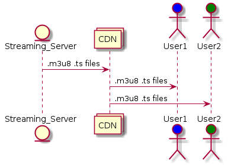

# BTStream
Streaming Media over DHT Bittorrent Network

The aim of this software is to create a uncensorable (video)content network. It's BackBone is the Bittorrent [DHT Network] and [Storing arbitrary data in the DHT] specifications.

## The relationship with HTTP Live Streaming

The basic idea of this project is heavily based on [HTTP Live Streaming] protocol. It's a sort of HLS without web server where the M3U8 is stored under the DHT network and the video fragments are .torrent files.

[DHT Network]: http://bittorrent.org/beps/bep_0005.html
[Storing arbitrary data in the DHT]: http://bittorrent.org/beps/bep_0044.html
[HTTP Live Streaming]:https://en.wikipedia.org/wiki/HTTP_Live_Streaming
